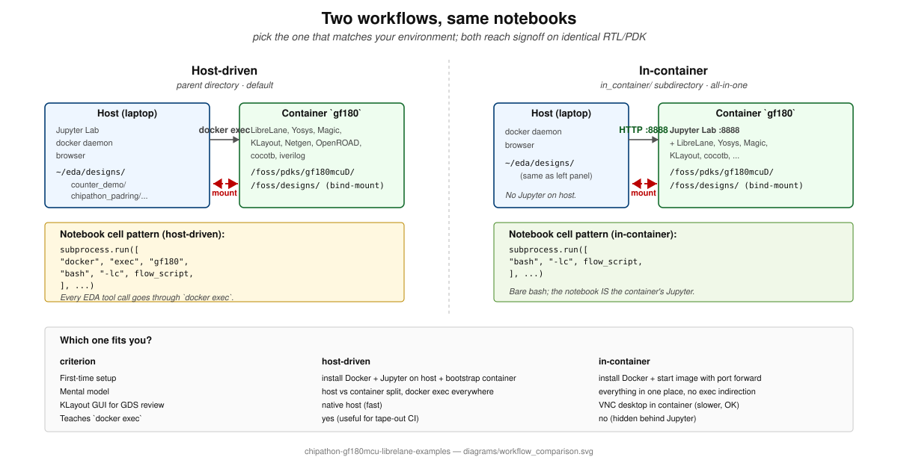
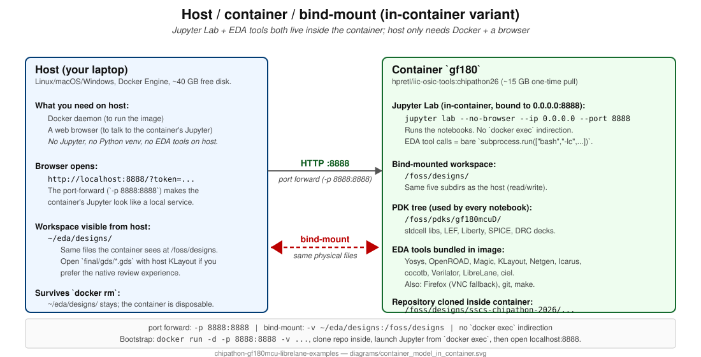

# LibreLane RTL-to-GDS on GF180MCU — in-container variant

Same five notebooks as the parent folder, restructured to run **inside** the
`hpretl/iic-osic-tools:chipathon26` container. Choose this variant when you do
not want to install Jupyter on your host machine, or when you prefer the
"everything in one package" mental model.

> **You only need Docker on your host.** Jupyter Lab, LibreLane, Magic,
> KLayout, Netgen, OpenROAD, cocotb, the GF180MCU PDK, and even Firefox all
> ship inside the image. Open a browser, point it at `http://localhost:8888`,
> and you are in.

For the host-driven workflow (Jupyter on your host, EDA tools reached via
`docker exec`), use the notebooks in the parent directory
[`../`](../README.md). The two workflows are functionally equivalent; pick
whichever fits your environment.



## Bootstrap (one-time)

```bash
# 1. Start the container with port-forwarding for Jupyter.
docker run -d --name gf180 \
    -p 8888:8888 \
    -v $HOME/eda/designs:/foss/designs:rw \
    --user $(id -u):$(id -g) \
    hpretl/iic-osic-tools:chipathon26 \
    --skip sleep infinity

# 2. Clone this repo INSIDE the container (so it lives under the
#    bind-mount and stays visible from the host too).
docker exec gf180 bash -lc '
    cd /foss/designs &&
    git clone https://github.com/sscs-ose/sscs-chipathon-2026.git
'

# 3. Start Jupyter Lab inside the container.
docker exec -d gf180 bash -lc '
    cd /foss/designs/sscs-chipathon-2026 &&
    jupyter lab --no-browser --ip 0.0.0.0 --port 8888 --allow-root
'

# 4. Find the access token (printed by Jupyter on startup).
docker exec gf180 jupyter server list

# 5. Open in your HOST browser:
#    http://localhost:8888/?token=<the-token-from-step-4>
#
# 6. Navigate to examples/librelane_rtl2gds_gf180/in_container/ and
#    open any notebook. Run top-to-bottom; flip the RUN_* flags as
#    you go.
```

If you cannot port-forward `8888` (corporate network, container-on-server,
etc.), use the container's built-in VNC desktop instead and open Firefox to
`http://localhost:8888` from there. The IIC-OSIC-Tools image ships Firefox.

## What changes vs the host-driven variant

| Concern | host-driven (parent) | in-container (here) |
|---|---|---|
| Jupyter runs on | host | container |
| `docker` on host needed | yes | yes (just to start the image) |
| Jupyter on host needed | yes | no |
| EDA tool calls | `subprocess.run(["docker", "exec", "gf180", ...])` | `subprocess.run(["bash", "-lc", ...])` |
| Project workspace | `~/eda/designs/` | `/foss/designs/` (same files via bind-mount) |
| KLayout GUI for GDS review | native host (recommended; fast) | VNC desktop inside container (slower) |
| First-time setup steps | install Docker + Jupyter + bootstrap container | install Docker + bootstrap container |
| When to pick this | mental model is split host/container | "everything in one package" |

The notebook content is otherwise identical — the same five lessons (slot
intro, bare counter, chip-top with custom macro, workshop-padring use,
multi-macro stitch) and the same `RUN_*` flag-gated steps.



## Reading order

Same as the parent folder. Status is the validation outcome of running each notebook end-to-end from inside the `gf180` container:

| # | Notebook | Wall time | Status |
|---|----------|-----------|--------|
| 00 | [`00_slots_explained.ipynb`](00_slots_explained.ipynb) | 2 min, read-only | validated |
| 01 | [`01_rtl2gds_counter.ipynb`](01_rtl2gds_counter.ipynb) | 1-2 min flow | validated, all signoff = 0 |
| 02 | [`02_rtl2gds_chip_top_custom.ipynb`](02_rtl2gds_chip_top_custom.ipynb) | ~80 min | Magic-DRC clean; same chip-top LVS quirk on the wafer-space template as the host-driven variant (documented in the notebook) |
| 03 | [`03_rtl2gds_chipathon_use.ipynb`](03_rtl2gds_chipathon_use.ipynb) | 35-45 min | validated, all signoff = 0 |
| 04 | [`04_counter_alu_multimacro/`](04_counter_alu_multimacro/) | ~60-90 min chip-top + ~5 min macros + cocotb | validated end-to-end, all signoff = 0 |

All `RUN_*` flags default to `False`. The first pass through every cell
only **prints** the commands it would run. Flip flags when you are ready
to commit to a step.

## Pre-flight check

Every in-container notebook has a pre-flight cell as the first executable
cell. It checks for `/.dockerenv` and verifies the toolchain is on PATH.
If you accidentally launch the notebook from your host browser pointing
at a host-side Jupyter, it bails with a clear error and points you back
at the host-driven variant in the parent directory.

## Bind-mount paths used by the in-container notebooks

Files written by the notebooks land under `/foss/designs/...` inside the
container. The bind-mount (`-v $HOME/eda/designs:/foss/designs:rw` in the
bootstrap) makes the same files visible on your host at `~/eda/designs/...`.
Stopping or removing the container preserves them.

| What | Container path | Host path (bind-mount) |
|------|----------------|------------------------|
| Workspace root | `/foss/designs` | `~/eda/designs` |
| Counter demo (nb 01) | `/foss/designs/counter_demo/` | `~/eda/designs/counter_demo/` |
| chip_top_custom (nb 02) | `/foss/designs/chip_custom/template/` | `~/eda/designs/chip_custom/template/` |
| Padring fork (nb 03) | `/foss/designs/chipathon_padring/template/` | `~/eda/designs/chipathon_padring/template/` |
| Multi-macro (nb 04) | `/foss/designs/multimacro_chipathon/{template,user_macros}/` | `~/eda/designs/multimacro_chipathon/...` |

Sources for nb 04 (`rtl/`, `tb/`, `librelane/`) are read from the **original
04 directory**, two levels up. We do not duplicate them under
`in_container/04_counter_alu_multimacro/`. The notebook resolves the
canonical copy via `Path(__file__).parent / ".." / ".." / "04_counter_alu_multimacro" / ...`.

## Switching between variants

The two variants share the same bind-mount, so artifacts produced by one
flow are visible to the other. Concretely: you can run notebook 01 in the
host-driven variant, then open notebook 02 in the in-container variant and
have it find the counter macro at `/foss/designs/counter_demo/runs/demo/final/`.
Just do not run the same notebook in both variants at the same time
(LibreLane will fight over the run directory).

## Troubleshooting

**Pre-flight cell raises `RuntimeError: must run inside the gf180 container`.**
You are running Jupyter on your host. Either switch to the host-driven
notebook in the parent directory, or follow the bootstrap above so Jupyter
runs inside the `gf180` container.

**`http://localhost:8888` shows a `Connection refused`.**
The `-p 8888:8888` port forward in step 1 is what makes the container's
Jupyter reachable from your host. If you started the container without it,
stop and remove the container, then re-run step 1 with the flag.

**`docker: command not found`.** You still need Docker on the host to even
run `docker run`. The in-container variant removes the *Jupyter* host
dependency, not the Docker host dependency.

**Firefox inside the VNC desktop opens slowly.** The host browser path
(`http://localhost:8888`) is faster. Only fall back to the VNC desktop if
host port forwarding is blocked.

See [`../docs/troubleshooting.md`](../docs/troubleshooting.md) for the
full diagnostic checklist (errors are common to both variants).

## Attribution

Same as the parent folder. See [`../CREDITS.md`](../CREDITS.md) for per-artifact credits.
